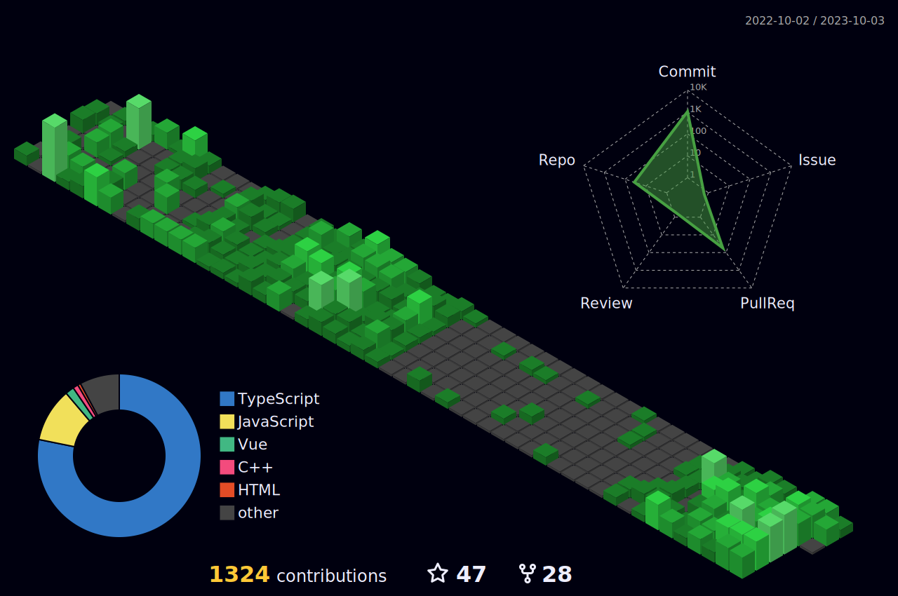

|  |  |
| ----------------------------------------------------------------------------------------------------------------------------------------------------------------------------------------------------- | ---------------------------------------------------------------------------------------------------------------------------------------------------------------------------------------- |

## TOOLS

   

## ACHIEVEMENTS
   

     
  

  ## CONTACT

   
  

